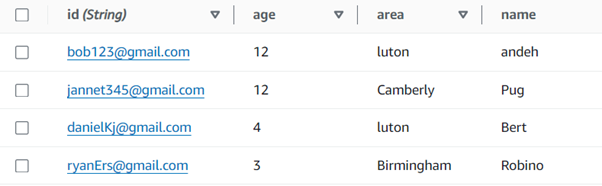
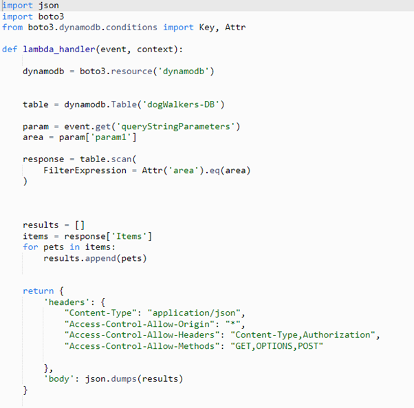
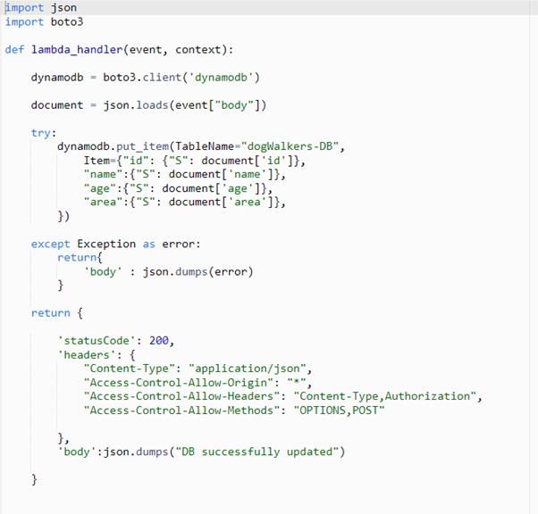
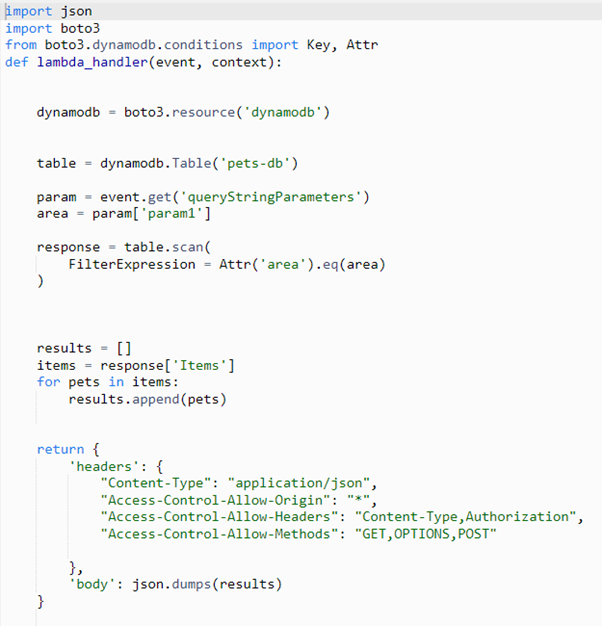
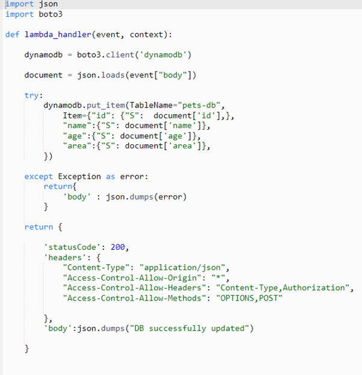

## Getting Started

First, run the development server:

```bash
npm run dev
# or
yarn dev
# or
pnpm dev
# or
bun dev
```

Open [http://localhost:3000](http://localhost:3000) with your browser to see the result.

You can start editing the page by modifying `app/page.tsx`. The page auto-updates as you edit the file.

This project uses [`next/font`](https://nextjs.org/docs/basic-features/font-optimization) to automatically optimize and load Inter, a custom Google Font.

## AWS Code
The code show under the AWS code folder is only there for viewing purposes. The code is acutally in the AWS console and is triggered over there once the API has been called.

## Steps for AWS Functionality Reproduction 


### Set up DynamoDB
Need a table to store dog walkers as shown in figure 1


(Figure 1: Dog Walkers DynamoDB Table)

Need a table to store pets as shown in figure 2.



(Figure 2: Pets DynamoDB Table)


### Set Up AWS Lambdas

Set up a lambda function to return all dog walkers based on what the user searches for as shown in figure 3. Note that the table name will be different depending on the name of your database.


 
(Figure 3: get all dog walkers Lambda Function)


Set up a lambda function to create dog walkers in the DynamoDB after user registers one as shown in figure 4.  



(Figure 4: Create Dog Walkers in Database Lambda)


Set up a get all pets function which will return all pets matching users search as shown in figure 5.


 
(Figure 5: Get All Pets Lambda Function)


Set up a function update pets database when a user registers a pet as shown in figure 6.


 
(Figure 6: Create Pets in Database Lambda Function)


### Set up AWS API Gateway

Create one API for dog walker functionality. 

Create one API for pet’s functionality.

All need a POST, GET and OPTIONS method.

### POST Method

1.	For both APIs this will be the method which updates your DynamoDB, so this method needs to trigger the corresponding lambda function which does that. I.e the pet API POST method will trigger the lambda function which creates pets in the DynamoDB. The integration request of the method will need to be set to “Lambda”

   
### GET Method

1.	This will be the method which returns pets or dog walkers based on what the user searches for. I.e if a user wanted to find a dog walker from Oxford then the API should trigger the lambda which will query the DynamoDB to return all dog walkers from Oxford. The integration request of the method will need to be set to “Lambda”


### OPTIONS Method

1.	Both the dog walkers and pets APIs will have an options method with the same configuration as shown in the next step.
2.	To set up the options method we need to first set the integration type as “Mock”. Next configure the integration response to match figure. Lastly configure the method response to match figure 8.
 
(Figure 7: OPTIONS Integration Response Configuration)


