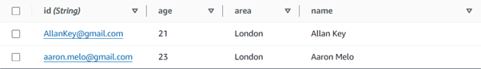

This is a [Next.js](https://nextjs.org/) project bootstrapped with [`create-next-app`](https://github.com/vercel/next.js/tree/canary/packages/create-next-app).

## Getting Started

First, run the development server:

```bash
npm run dev
# or
yarn dev
# or
pnpm dev
# or
bun dev
```

Open [http://localhost:3000](http://localhost:3000) with your browser to see the result.

You can start editing the page by modifying `app/page.tsx`. The page auto-updates as you edit the file.

This project uses [`next/font`](https://nextjs.org/docs/basic-features/font-optimization) to automatically optimize and load Inter, a custom Google Font.

## AWS Code
The code show under the AWS code folder is only there for viewing purposes. The code is acutally in the AWS console and is triggered over there once the API has been called.

## Steps for AWS Functionality Reproduction 


Set up DynamoDB
Need a table to store dog walkers as shown in figure 1



(Figure 1: Dog Walkers DynamoDB Table)

Need a table to store pets as shown in figure 2.

(Figure 2: Pets DynamoDB Table)

